
</a> Unified Mentor Private Limited 

  
<!-- Image Logo -->

    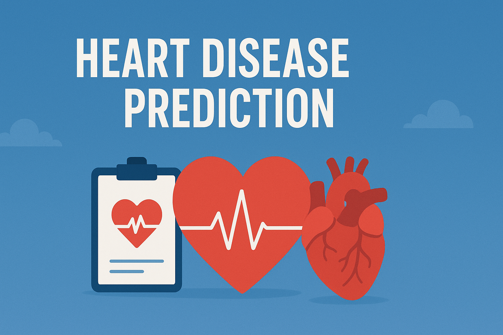

 

<!-- project and ML title -->
<h1 align='center' style="margin-bottom: 0px;">
<!-- <a href="https://git.io/typing-svg"> -->
  
</a></h1>

<!-- ML name -->
<h4 align='center' style="margin-top: 0; margin-bottom: 10px;">
<!-- <a href="https://git.io/typing-svg"> -->
  
</a></h4>

---
 
<!-- Table of content -->
## Table of Contant

* 
About this Project.

* 
Problem Statment.

* 
What DataSet cointains?

* 
Main library to be used.

* 
Visualizations/Chart.

* 
Conclusion.

* 
Acknowledgment.

 

---
<!-- About this Project -->
  
## About this Project:

    This project focuses on predicting heart disease using a dataset containing various health indicators. We performed Exploratory Data Analysis (EDA) to understand the data, handled duplicates, and visualized key relationships. We then implemented and evaluated several machine learning models (Logistic Regression, KNN, SVM, Decision Tree, Random Forest, and XGBoost), using cross-validation and hyperparameter tuning to optimize performance. The best-performing model, K-Nearest Neighbors (KNN), was saved for potential deployment. Key features influencing prediction were identified through the analysis.
      

---
  
## Problem Statement:

Heart disease is a major global health concern. Early and accurate prediction is crucial for timely intervention and improved patient outcomes. This project aims to develop a machine learning model that can predict the likelihood of heart disease based on readily available patient health metrics, thereby assisting healthcare professionals in risk assessment and diagnosis. 

- Can we predict heart disease with high accuracy using readily available health data? 
- Which health indicators are the strongest predictors of heart disease in this dataset? 
- How do different machine learning models perform in predicting heart disease? 
- Can we identify patterns in patient data that indicate a higher risk of heart disease? 
- How can machine learning contribute to early diagnosis and prevention of heart disease? 
- Is there a significant difference in heart disease prevalence between genders in this dataset? 
  
---

  

<!-- What Data set Containes -->
<!-- columns and their descriptions -->
<!-- What Data set Containes -->
<!-- columns and their descriptions -->

    

    What Data Set Contains?

 

1. age - Age of the patient.  
2. sex - Gender of the patient. Values: 1 = male, 0 = female.  
3. cp - Chest pain type. Values: 1 = Typical angina, 2 = Atypical angina, 3 = Non-anginal pain, 4 = Asymptomatic.  
4. resting_bp_s - Resting Blood Pressure (in mm Hg).  
5. cholesterol - Serum Cholesterol level (in mg/dl).  
6. fasting_blood_sugar - Fasting Blood Sugar > 120 mg/dl. Values: 1 = true, 0 = false.  
7. resting_ecg - Resting electrocardiographic results. Values: 0 = Normal, 1 = ST-T wave abnormality, 2 = Left ventricular hypertrophy.  
8. max_heart_rate - Maximum heart rate achieved.  
9. exercise_angina - Exercise-induced angina. Values: 1 = yes, 0 = no.  
10. oldpeak - ST depression induced by exercise relative to rest.  
11. st_slope - Slope of the peak exercise ST segment. Values: 1 = Upward, 2 = Flat, 3 = Downward.  
12. target - Outcome variable (heart attack risk). Values: 1 = more chance of heart attack, 0 = less chance of heart attack.  

  

---
  
<!-- Library used in projects and their description -->

 
  
 Main Libraries Used 
 
    
  

  🔢 <b>NumPy</b> – For efficient numerical computations, array operations, and mathematical functions.  
  📊 <b>Pandas</b> – To load, clean, and manipulate structured datasets for analysis and modeling.  
  📈 <b>Matplotlib & Seaborn</b> – For creating visualizations such as histograms, heatmaps, and correlation plots to explore data patterns and relationships.  
  🧪 <b>SciPy</b> – Used for performing statistical analysis, outlier detection, and hypothesis testing.  
  ⚙️ <b>scikit-learn (sklearn)</b> – The main machine learning library used for:
  <ul> 
    <li>📦 Data preprocessing (<code>StandardScaler</code>)</li> 
    <li>🧠 Model building (<code>LogisticRegression</code>, <code>KNeighborsClassifier</code>, <code>SVC</code>, <code>DecisionTreeClassifier</code>, <code>RandomForestClassifier</code>)</li> 
    <li>🎯 Model evaluation (<code>accuracy_score</code>, <code>precision_score</code>, <code>recall_score</code>, <code>f1_score</code>, <code>roc_auc_score</code>, <code>confusion_matrix</code>, <code>ConfusionMatrixDisplay</code>)</li> 
    <li>🧩 Model tuning and validation (<code>train_test_split</code>, <code>cross_val_score</code>, <code>GridSearchCV</code>, <code>RandomizedSearchCV</code>)</li>
  </ul>
  ⚡ <b>XGBoost</b> – A powerful gradient boosting algorithm used for improving prediction performance and handling complex data patterns. 
  
 

  

---
  

 Visualizations/Chart. 

    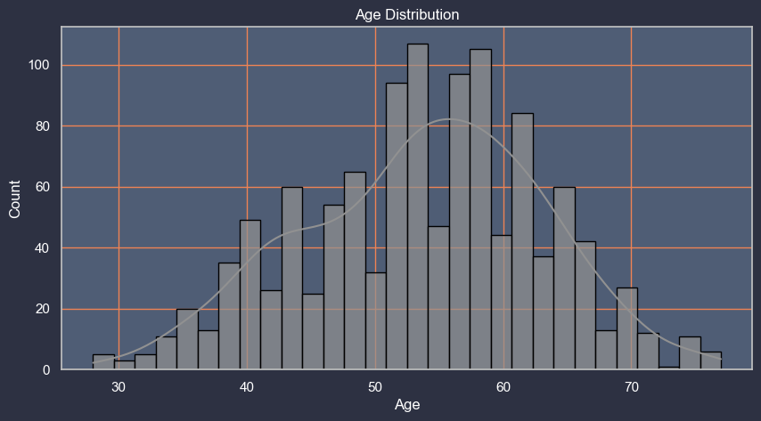
    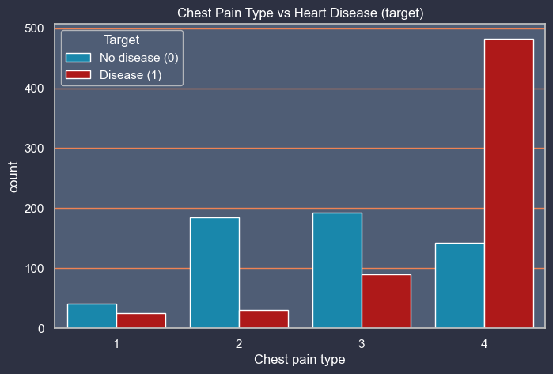
    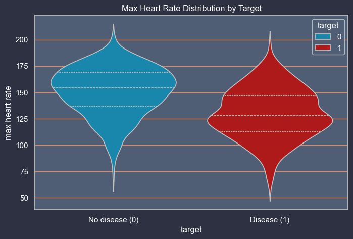
    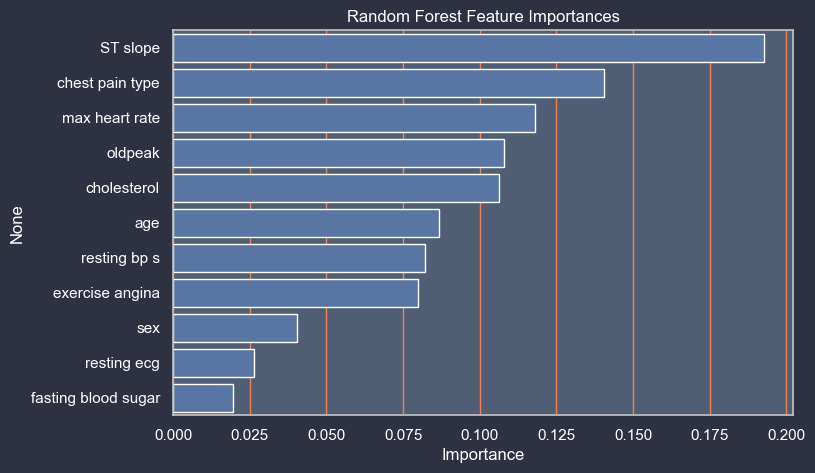
    
    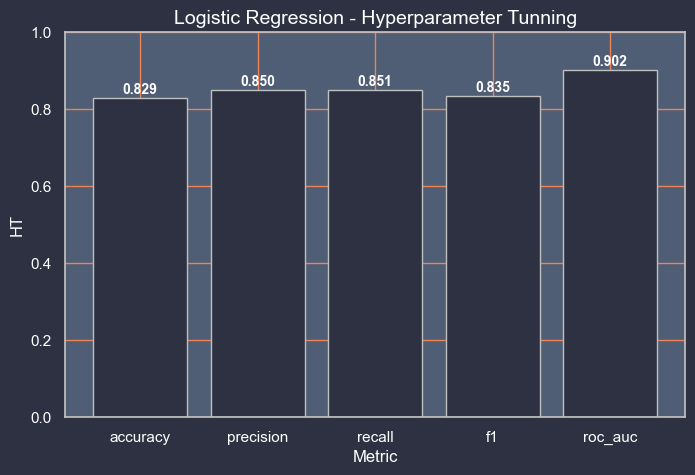
    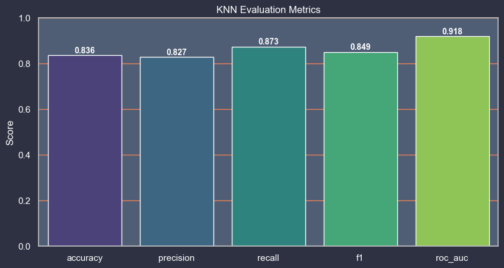
    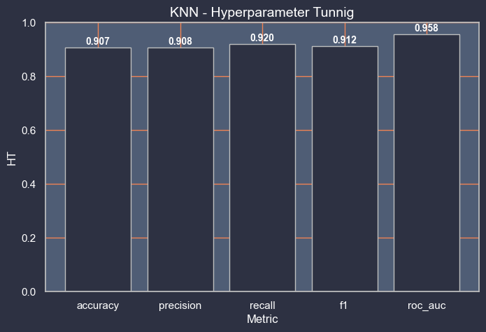
    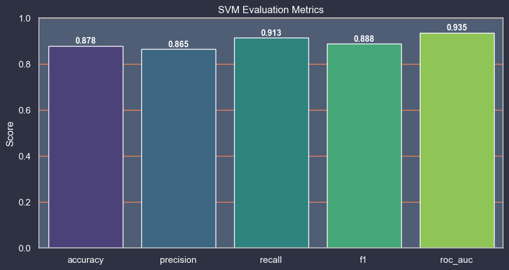
    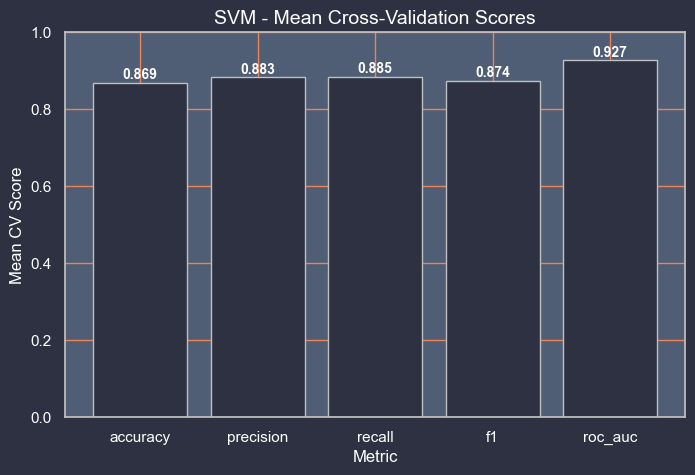
    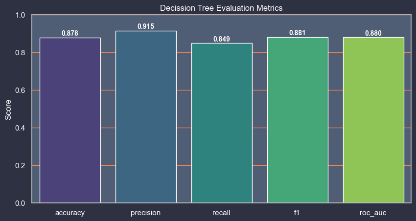
    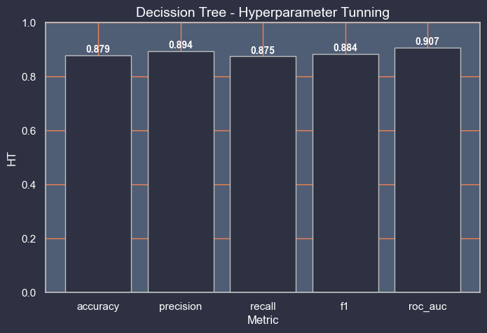
    
    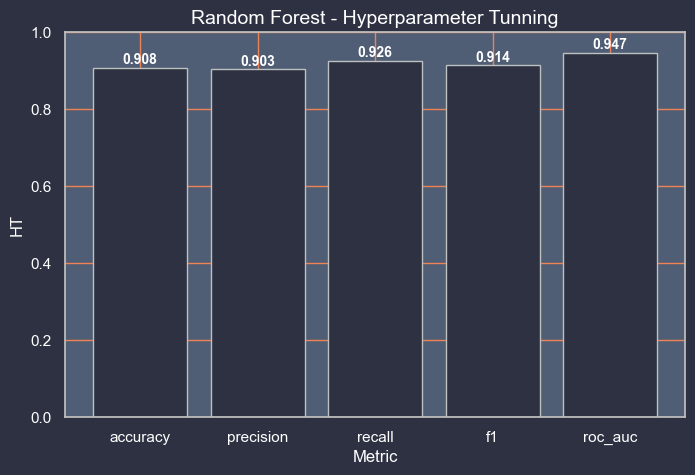
    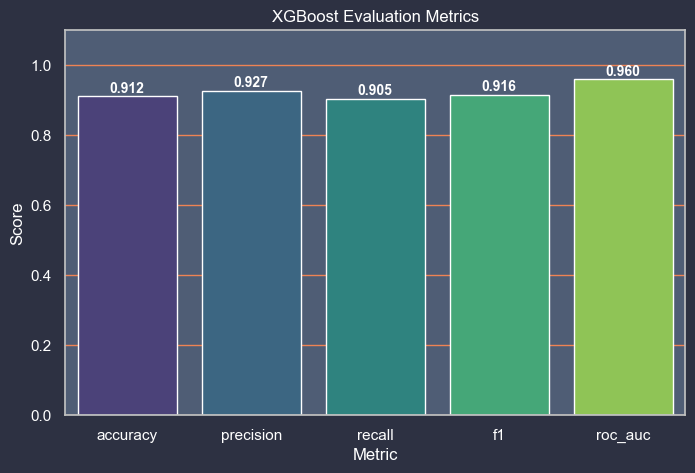
    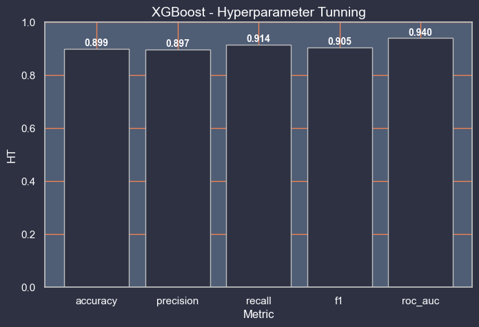
    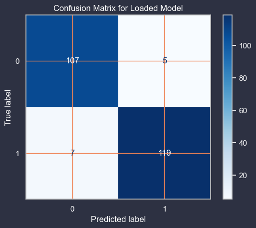

---
  
## Conclusion:

This project aimed to predict heart disease based on various health indicators. We performed extensive Exploratory Data Analysis (EDA) to understand the dataset, identifying key features and their distributions, as well as checking for missing and duplicate values.
Several machine learning models were implemented and evaluated, including Logistic Regression, K-Nearest Neighbors, Support Vector Machine, Decision Tree, Random Forest, and XGBoost. Cross-validation and hyperparameter tuning were applied to improve model performance.
Based on the evaluation metrics, particularly accuracy, precision, recall, F1 score, and ROC-AUC, the K-Nearest Neighbors (KNN) model with hyperparameter tuning showed the best performance on the test set, achieving an accuracy of approximately 95%. This suggests that KNN is the most suitable model for this dataset in predicting heart disease.
The analysis also highlighted important features like ST slope, chest pain type, and max heart rate as significant predictors of heart disease.
In conclusion, this project successfully built and evaluated several models for heart disease prediction, with the tuned KNN model demonstrating promising results. The saved model can be used for future deployment to predict heart disease on new, unseen data.

  

---
  
### Acknowledgments:

This project is dedicated to applying machine learning techniques to understand and predict heart disease, contributing to early diagnosis and better healthcare outcomes. Sincere thanks to Unified Mentor Private Limited for providing the opportunity and platform to carry out this work. Appreciation is also extended to the open-source community for developing the powerful tools and libraries that made this project possible.

 Created with 🧠 by <a href="https://github.com/KushangShah">Kushang Shah</a>

  
